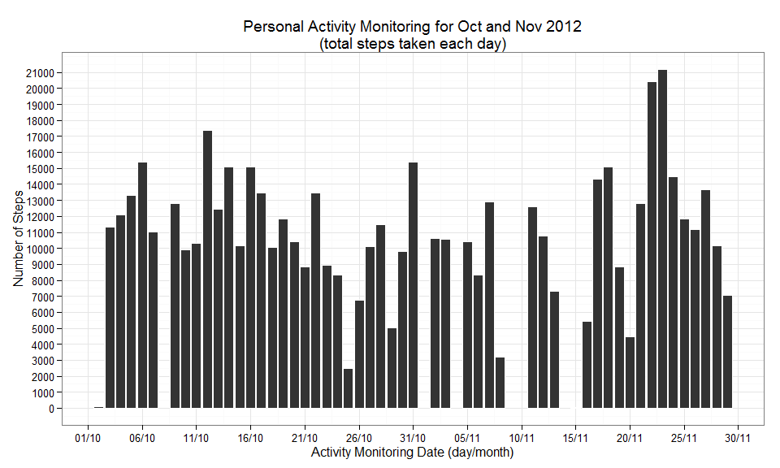
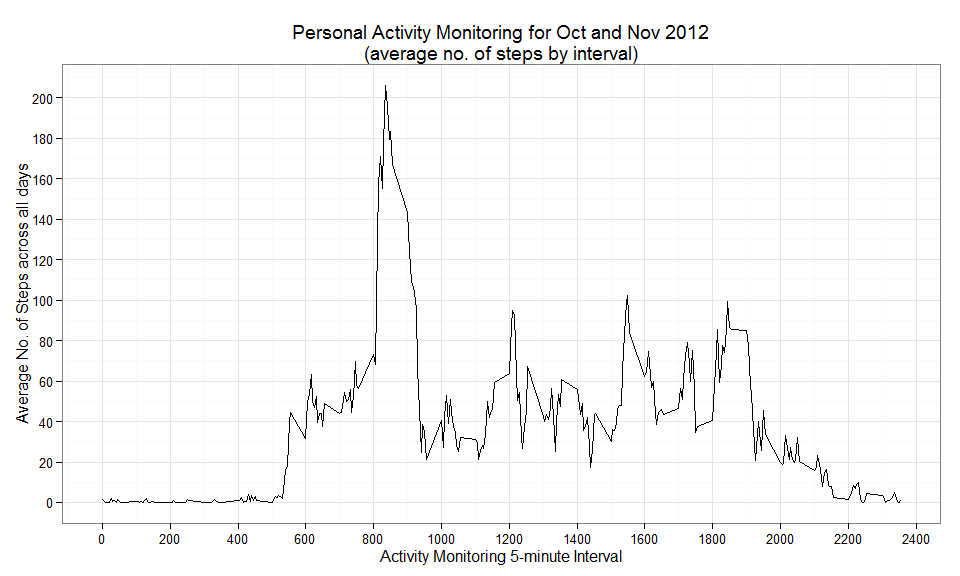
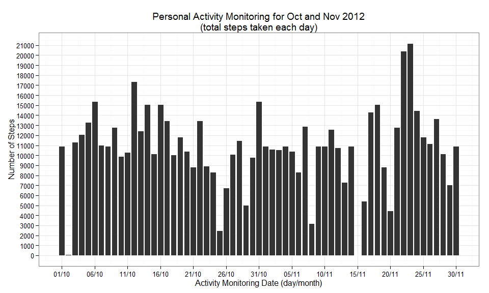
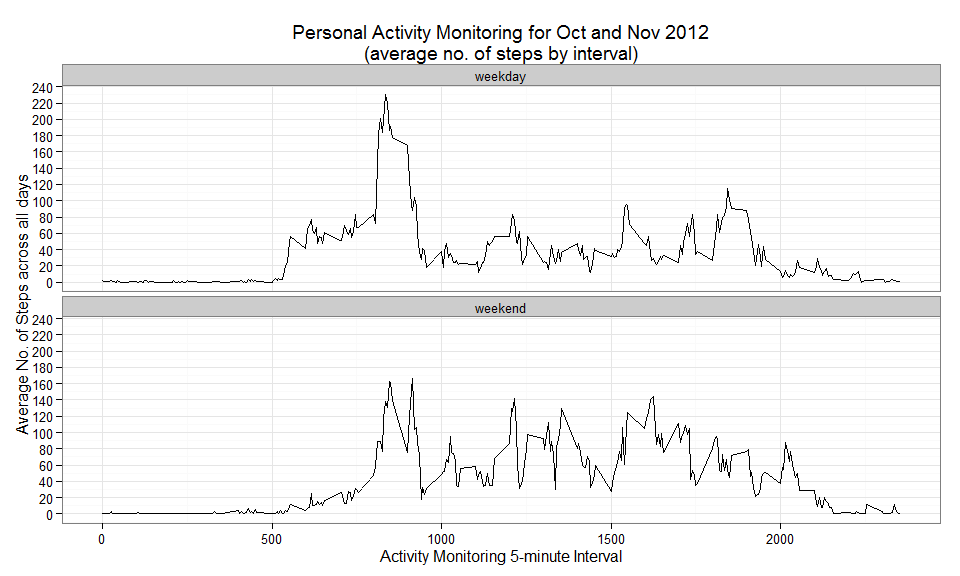

# Reproducible Research: Peer Assessment 1

## Loading and preprocessing the data

1. Load the required libraries

```r
    ## load libraries and suppress messages and warning messages
    suppressWarnings(suppressMessages(library(dplyr)))
    suppressWarnings(suppressMessages(library(ggplot2)))
    suppressWarnings(suppressMessages(library(scales)))
```

2. Load the data

```r
    ## read the activity file, assuming activity file and this file are in the same folder
    data <- read.csv("activity.csv")
```

3. Process/transform the data

```r
    ## convert date to date data type
    data$date = as.Date(data$date)
```


## What is mean total number of steps taken per day?

1. Calculate the total number of steps taken per day

```r
    ## sum the number of steps, group the data by date
    groupby <- group_by(data, date)
    data_summary_day <- summarize(groupby, total_steps=sum(steps))
```

2. Make a histogram of the total number of steps taken each day

```r
    ggplot(data_summary_day, aes(x=date, y=total_steps)) + 
       geom_histogram(colour="white", stat="identity") +
       ggtitle("Personal Activity Monitoring for Oct and Nov 2012\n(total steps taken each day)") + 
       ylab("Number of Steps") + 
       xlab("Activity Monitoring Date (day/month)") + 
       theme_bw() +
       scale_x_date(labels=date_format("%d/%m"), 
                    breaks=seq(min(data_summary_day$date), 
                               max(data_summary_day$date), 5)) +
       scale_y_continuous(breaks=seq(0, 
                                     max(data_summary_day$total_steps, na.rm=TRUE), 1000))
```

 

3. Calculate and report the mean and median of the total number of steps taken per day


```r
    ## calculate the mean of the total number of steps taken per day
    mean_steps_perday <- mean(data_summary_day$total_steps, na.rm=TRUE)
    mean_steps_perday <- as.character(round(mean_steps_perday, digits=2))
    print(mean_steps_perday)
```

```
## [1] "10766.19"
```

```r
    ## calculate the median of the total number of steps taken per day
    median_steps_perday <- median(data_summary_day$total_steps, na.rm=TRUE)
    print(median_steps_perday)
```

```
## [1] 10765
```

The mean of the total number of steps taken per day is **10766.19**.

The median of the total number of steps taken per day is **10765**.


## What is the average daily activity pattern?

1. Calculate the average number of steps taken for each interval, averaged across all days

```r
    ## average(mean) number of steps, group the data by interval
    groupby <- group_by(data, interval)
    data_summary_interval <- summarize(groupby, average_steps=mean(steps, na.rm=TRUE))
```

2. Make a time series plot of the 5-minute interval (x-axis) and the average number of steps taken (y-axis)


```r
    ggplot(data_summary_interval, aes(x=interval, y=average_steps)) + 
       geom_line() +
       ggtitle("Personal Activity Monitoring for Oct and Nov 2012\n(average no. of steps by interval)") +
       ylab("Average No. of Steps across all days") + 
       xlab("Activity Monitoring 5-minute Interval") +
       theme_bw() +
       scale_x_continuous(breaks=seq(min(data_summary_interval$interval), 
                                     max(data_summary_interval$interval)+100, 200)) +
       scale_y_continuous(breaks=seq(min(data_summary_interval$average_steps), 
                                     max(data_summary_interval$average_steps)+20, 20))
```

 

3. Which 5-minute interval, on average across all the days in the dataset, contains the maximum number of steps?

```r
    ## find the maximum average steps
    max_steps <- data_summary_interval$average_steps==max(data_summary_interval$average_steps)

    ## find the interval with the maximum steps
    interval_max_steps <- data_summary_interval$interval[max_steps]
    print(interval_max_steps)
```

```
## [1] 835
```

The 5-minute interval that contains the maximum number of steps is **835**.


## Imputing missing values

1. Calculate and report the total number of missing values in the dataset (i.e. the total number of rows with NAs)


```r
    no_of_na <- sum(is.na(data$steps))
    print(no_of_na)
```

```
## [1] 2304
```

The total number of missing values is **2304**.


2. Devise a strategy for filling in all of the missing values in the dataset. The strategy does not need to be sophisticated. For example, you could use the mean/median for that day, or the mean for that 5-minute interval, etc.

**The mean of the steps taken for each the 5-minute interval** is used as a strategy for filling the NA values. First, create a dataset to calculate the mean of the steps taken for each 5-minute interval. Replace the steps with the NA values in the original data with the calculated mean for the same interval to create a new dataset.   


```r
    ## calculate the mean of the steps taken for each 5-minute internval
    groupby <- group_by(data, interval)
    data_summary_interval_mean <- summarize(groupby, mean_steps=ceiling(mean(steps, na.rm=TRUE)))
    
    ## check to confirm there is no NA for each 5-minute interval  
    sum(is.na(data_summary_interval_mean$mean_steps))
```

```
## [1] 0
```

3. Create a new dataset that is equal to the original dataset but with the missing data filled in.

```r
    ## merge the original data with the strategy dataset derived above
    temp <- merge(data, data_summary_interval_mean, by="interval")

    ## Replace the NA values from the strategy dataset for the same interval
    temp[is.na(temp$steps),]$steps <- temp[is.na(temp$steps),]$mean_steps

    ## sort the data by date
    temp <- arrange(temp, date)

    ## create a new dataset for the required fields only (steps, date, interval)
    data_new <- select(temp, steps, date, interval)
```

4. Make a histogram of the total number of steps taken each day and Calculate and report the mean and median total number of steps taken per day. Do these values differ from the estimates from the first part of the assignment? What is the impact of imputing missing data on the estimates of the total daily number of steps?


```r
    ## sum the number of steps, group the data by date
    groupby <- group_by(data_new, date)
    data_summary_day_new <- summarize(groupby, total_steps=sum(steps))

    ggplot(data_summary_day_new, aes(x=date, y=total_steps)) + 
       geom_histogram(colour="white", stat="identity") +
       ggtitle("Personal Activity Monitoring for Oct and Nov 2012\n(total steps taken each day)") + 
       ylab("Number of Steps") + 
       xlab("Activity Monitoring Date (day/month)") + 
       theme_bw() +
       scale_x_date(labels=date_format("%d/%m"), 
                    breaks=seq(min(data_summary_day_new$date), 
                               max(data_summary_day_new$date), 5)) +
       scale_y_continuous(breaks=seq(0, 
                                     max(data_summary_day_new$total_steps), 1000))
```

 


```r
    ## calculate the mean of the total number of steps taken per day
    mean_steps_perday_new <- mean(data_summary_day_new$total_steps)
    mean_steps_perday_new <- as.character(round(mean_steps_perday_new, digits=2))
    print(mean_steps_perday_new)
```

```
## [1] "10784.92"
```

```r
    ## calculate the median of the total number of steps taken per day
    median_steps_perday_new <- median(data_summary_day_new$total_steps)
    median_steps_perday_new <- as.character(round(median_steps_perday_new, digits=2))
    print(median_steps_perday_new)
```

```
## [1] "10909"
```

The mean of the total number of steps taken per day is **10784.92**.

The median of the total number of steps taken per day is **10909**.

The values differ from the estimates from the first part of the assignment. The impact of imputing missing data on the estimates of the total daily number of steps is the mean and median are higher. Also as shown in the histogram, some days have higher total number of steps than before.


## Are there differences in activity patterns between weekdays and weekends?

1.Create a new factor variable in the dataset with two levels - "weekday" and "weekend" indicating whether a given date is a weekday or weekend day.


```r
    ## create a day_type variable and store "weekday" first
    data_new$day_type <- "weekday"
    
    ## store "weekend" for Saturday and Sunday
    data_new[weekdays(data_new$date)=="Saturday" | weekdays(data_new$date)== "Sunday", ]$day_type <- "weekend"
```

2.Make a panel plot containing a time series plot of the 5-minute interval (x-axis) and the average number of steps taken, averaged across all weekday days or weekend days (y-axis).


```r
    ## average(mean) number of steps, group the data by interval and day type
    groupby <- group_by(data_new, day_type, interval)
    data_summary_daytype <- summarize(groupby, average_steps=mean(steps))
```


```r
    ggplot(data_summary_daytype, aes(x=interval, y=average_steps)) + 
       geom_line() +
       facet_wrap(~day_type, ncol=1) + 
       ggtitle("Personal Activity Monitoring for Oct and Nov 2012\n(average no. of steps by interval)") +
       ylab("Average No. of Steps across all days") + 
       xlab("Activity Monitoring 5-minute Interval") +
       theme_bw() +
       scale_x_continuous(breaks=seq(min(data_summary_daytype$interval), 
                                     max(data_summary_daytype$interval)+100, 500)) +
       scale_y_continuous(breaks=seq(min(data_summary_daytype$average_steps), 
                                     max(data_summary_daytype$average_steps)+20, 20))
```

 

